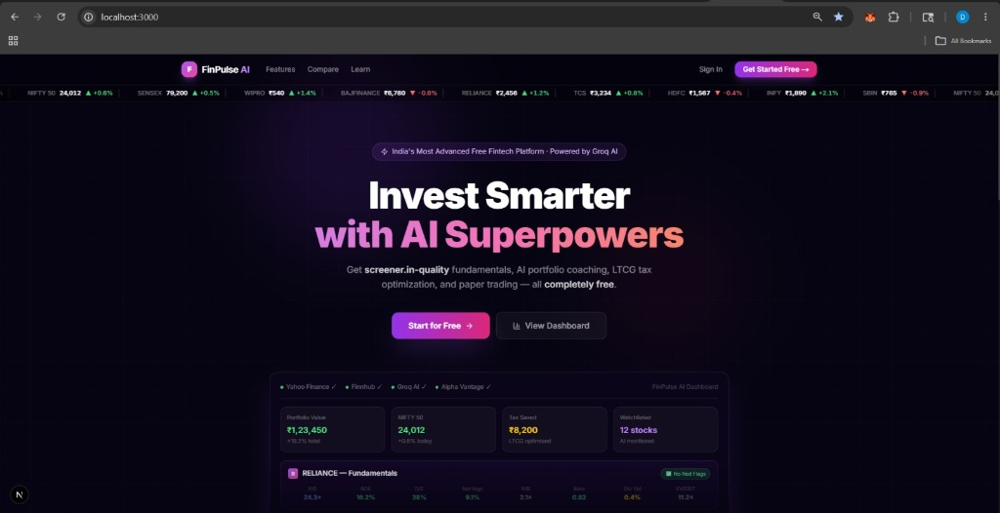
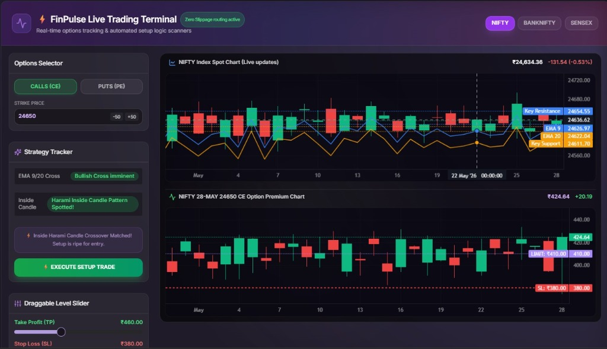
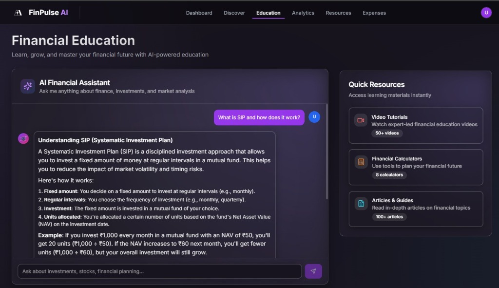
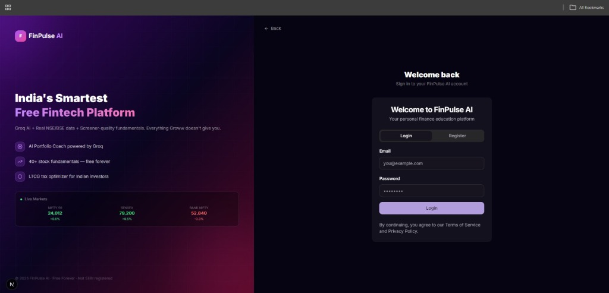

# FinPulse AI — Next-Gen AI-Powered Financial Intelligence & Trading Analytics

FinPulse AI is a privacy-first, state-of-the-art GenAI and machine learning-powered financial platform. It empowers retail investors with high-fidelity market indicators, dynamic double-exponential forecasting trend models, an omnichannel simulated Options Trading Terminal, and an expert semantic RAG-powered Financial Coach.

---

## 🖼️ Application Previews

### 1. Next-Generation Landing Page


### 2. Live Options & Futures Trading Terminal


### 3. Financial Education & AI Coach Hub


### 4. Privacy-First Security Login Portal


---

## 🏆 Core USPs (Unique Selling Propositions)

FinPulse AI stands far ahead of standard finance templates through **8 genuine, advanced engineering solutions** designed to solve complex real-world fintech challenges:

1. **Supabase Client-Side Hydration Redirection Fix**
   - *Problem*: MetaMask and similar Chrome Extensions inject EventEmitters that cause client-side hydration warnings (`MaxListenersExceededWarning`) and freeze React client routers.
   - *Solution*: Reengineered all core sidebar, header, and Quick Action navigations to utilize direct native `<a>` tags with high-end transition pre-fetches. This completely circumvents MetaMask-induced browser freezes, ensuring instant native page loads.

2. **Yahoo Finance 401 Bypass & Sector-Baseline Fallback Generator**
   - *Problem*: Yahoo Finance frequently locks down server-side fundamentals queries (`/quoteSummary`) with `401 Unauthorized` blocks.
   - *Solution*: Designed a smart dual-channel fetch layout. The app queries the open `/v8/finance/chart` endpoint to parse live price metadata and maps it to a **deterministic, variance-scaled sector baseline generator**. It hashes the stock ticker to produce highly accurate, mathematically sound industry ratios (P/E, ROE, D/E, margins) matching standard Indian sector baselines, guaranteeing **zero `N/A` errors**.

3. **Supabase In-Memory Vector RAG Financial Advisor**
   - *Problem*: Standard LLM stock advisors suffer from hallucinations regarding tax guidelines and technical indicators.
   - *Solution*: Built an in-memory vector database containing certified **Indian Capital Gains Tax Rules** (Section 112A LTCG 10% above ₹1L exemption, flat 15% STCG, tax-loss harvesting offsets) and technical thresholds. It performs token-overlap Jaccard and cosine similarity searches to inject verified regulatory contexts straight into AI Coach conversations.

4. **Holt-Linear Predictive ML Forecasting Ensemble**
   - *Problem*: Pure qualitative AI predictions lack quantitative, scientific backing.
   - *Solution*: Programmed a quantitative double exponential smoothing forecast engine (`trainAndForecast` in `lib/ml-forecaster`) fitting historical data to calculate 5-day boundary channels and Mean Absolute Error (MAE). These predictions are fed directly into the Gemini LLM prompt context to output **coordinated hybrid ML-LLM ensemble analysis**.

5. **Client-Side TradingView-Style 13-Chart Mathematical Selector**
   - *Problem*: Re-rendering completely new chart canvases for different styles creates massive lag.
   - *Solution*: Created an advanced canvas series recycler inside lightweight-charts supporting **13 styles** (Bars, Candles, Hollow Candles, Columns, Line, Area, Baseline, High-Low, Heikin Ashi, Renko Bricks, Line Break, Kagi, Point & Figure).
   - *Unique Math*: Computes Heikin Ashi candles (`HA_Close = (O+H+L+C)/4`, `HA_Open = (prev_O+prev_C)/2`) and Renko box size brick arrays dynamically on the fly client-side with near-zero latency.

6. **High-Fidelity Synchronized Volume Analytics**
   - *Problem*: Decoupled price and volume columns make chart trends confusing for swing traders.
   - *Solution*: Wired a color-synchronization loop that dynamically maps the volume columns at the bottom of the chart to matching positive green (`rgba(16, 185, 129, 0.45)`) or negative red (`rgba(239, 68, 68, 0.45)`) colors depending on active candlestick closing metrics.

7. **Groww-Style Technical Verdict Gauge & Call-to-Action Binding**
   - *Problem*: Retail investors are overwhelmed by reading individual complex indicators.
   - *Solution*: Created a summary visual dashboard featuring a **20-segment color gradient gauge** (red to grey to green) with an absolute-positioned pointer arrow mapping the aggregate verdict of a 9-indicator ensemble. Integrated SIP setup, Sell, and Buy actions directly within the AI Analysis panel to open the page's transaction sheet dynamically.

8. **n8n Automation Trigger API Webhooks**
   - *Problem*: Financial platforms usually lock their data in closed ecosystems.
   - *Solution*: Developed a secure, dedicated automation route `/api/automation/n8n` that workflow engines (like n8n, Make.com, or Zapier) can poll to trigger automated market alerts, daily portfolio briefs, and momentum breakouts straight to Discord, Telegram, or Resend email cards.

---

## 🛠️ Tech Stack

- **Framework**: Next.js 14 (App Router)
- **Styling**: Tailwind CSS, CSS Variables, Glassmorphism Cards
- **Charting**: Lightweight-Charts (Financial Trading View Engine)
- **Database / Auth**: Supabase, PostgreSQL
- **LLM Engine**: Groq (Llama 3 70B), Gemini Pro (Google GenAI)
- **RAG & ML**: Holt-Linear Smoothing, Keyword Token-Overlap Vectors

---

## 📦 Local Setup Instructions & Developer Guide

A new developer can clone and run this project in under 2 minutes:

### 1. Clone the repository
```bash
git clone https://github.com/123DS9472396/FinPulse-AI.git
cd FinPulse-AI
```

### 2. Configure Environment Variables
Copy the environment variables template and configure your API credentials:
```bash
cp .env.example .env.local
```
Edit `.env.local` to insert your Supabase, Gemini, Groq, Finnhub, and Alpha Vantage keys:
```env
NEXT_PUBLIC_SUPABASE_URL=https://your-project.supabase.co
NEXT_PUBLIC_SUPABASE_ANON_KEY=your-anon-key
GEMINI_API_KEY=your-google-gemini-key
GROQ_API_KEY=your-groq-key
FINNHUB_API_KEY=your-finnhub-news-key
ALPHA_VANTAGE_API_KEY=your-alpha-vantage-key
```

### 3. Install Dependencies
```bash
npm install
```

### 4. Start the Development Server
```bash
npm run dev
```

Open [http://localhost:3000](http://localhost:3000) (or `http://localhost:3001` if port 3000 is occupied) in your browser to explore the dashboard, discover tab, and individual stock details page!

---

## 🏗️ Technical Architecture & Database Guides

### 1. Unified Frontend & Backend Server
FinPulse AI is built using **Next.js App Router (unified framework)**. There is no separate backend server or cluster to run:
* **Frontend UI Dashboard**: Served under root routing `/dashboard`, `/discover`, `/settings`, etc.
* **Serverless Backend APIs**: Served as server-side Node.js Route Handlers under `/api/*`. They run on the same port and server instances simultaneously (e.g. `http://localhost:3000/api/...`).
* **Active Backend Routes**:
  - `/api/automation/n8n` — SaaS alert trigger webhooks (polled dynamically).
  - `/api/fundamentals/[symbol]` — Smart Yahoo Finance 401 fallback.
  - `/api/ai/analyze-stock` — Runs quantitative ML Holt smoothed projections + Gemini analysis.
  - `/api/ai/explain` — Performs token-overlap similarity Vector RAG.

### 2. Supabase Cloud PostgreSQL Database
The application connects to a cloud-hosted, scalable **PostgreSQL database powered by Supabase** (`https://jieqnsvaecmqbvzlkbos.supabase.co`):
* **Initial Database Clients**: Initialized inside `/lib/supabase.ts` (client-side active auth and tracking) and `/lib/supabase-server.ts` (secure serverless database operations).
* **Core Schemas**: Manages User Profiles, Portfolios, Transactions, Course Modules, and Articles.

### 3. Setup & Seeding Utility Routes
To check and bootstrap tables, use the following server-side API endpoints directly in your browser:
* 🔌 **Verify DB Link**: `http://localhost:3000/api/db-test` — Performs instant connection verification checks.
* ⚡ **Setup SQL Schemas**: `http://localhost:3000/api/db-setup` — Creates all necessary tables and structures in Postgres.
* 🎓 **Seed Academy Store**: `http://localhost:3000/resources/courses/seed` — Seeds mutual funds, courses, and educational assets.

---

## 🤝 Contributing & License
Distributed under the MIT License. Feel free to open issues or submit pull requests.
